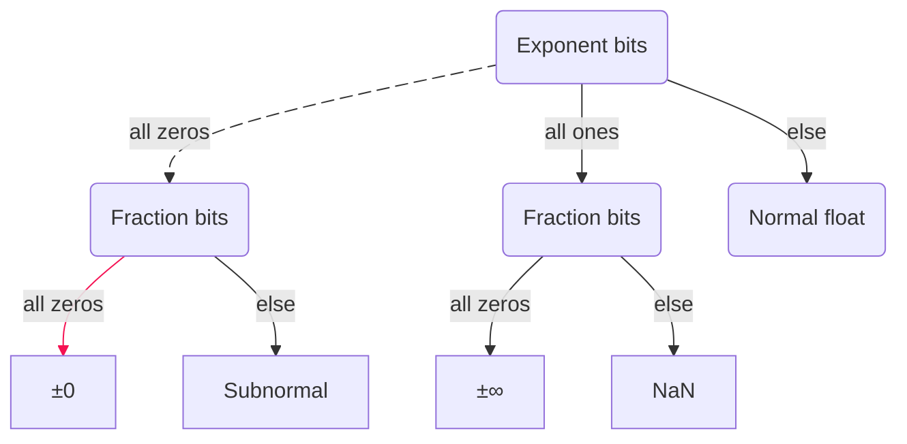
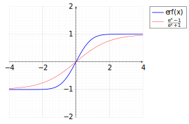
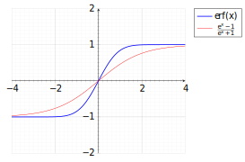

# Github-Markdown-Features
I work with github flavoured markdown a LOT.. so here's some of the things ive come across over time

First of all, you can [refer to the github flavoured markdown spec](https://github.github.com/gfm/) ~~which I myself have not done yet..~~

Github themselves also has a lot of documentation on their stuff of course
- https://docs.github.com/en/get-started/writing-on-github/getting-started-with-writing-and-formatting-on-github/basic-writing-and-formatting-syntax


## Text as links

You can [put text as links](https://www.youtube.com/watch?v=dQw4w9WgXcQ)

```html
[put the display text here](and put the hyperlink here)
```

## Text modifiers

Of course you can use the tilde `~` character to strike out text like \~\~this\~\~

You can also do what I just did, make the character just a character, by putting a backslash before it (escaping the character) \\~

- Make things *italic* \*with this\*
- Make things **bold** \*\*with even more\*\*
- Combine them ***like this*** \*\*\*by using three instead\*\*\*

# Separations

If you feel the need to add a horizontal bar somewhere

---

like this above, you can add three dashes on their own line to separate \-\-\-


## Code Blocks

You can make `inline codeblocks` \`like so\` (this character is the one to the left of the numeric 1 key, under escape)

```c
int main(int argc, const char* argv[])
{
	printf("But by now im sure you know there are code blocks in github\n");
	printf("But how the amount of things you can do with them is actually kinda crazy.\n");
	return 0;
}
```

Github says [they use Linguist to detect the language](https://docs.github.com/en/get-started/writing-on-github/working-with-advanced-formatting/creating-and-highlighting-code-blocks#syntax-highlighting) but there are some interesting extensions as well.

## Mermaid Graphs

Github has a whole thing on ["creating diagrams"](https://docs.github.com/en/get-started/writing-on-github/working-with-advanced-formatting/creating-diagrams)



You can do an insane amount with the mermaid graph

```
```mermaid
flowchart TD
    A(Exponent bits) e1@--> |all zeros| B(Fraction bits);
    A --> |all ones| C(Fraction bits);
    A --> |else| N(Normal float);

    B --> |all zeros| Z[&pm;0];
    B --> |else| S[Subnormal];

    C --> |all zeros| I[&pm;&infin;];
    C --> |else| Q[NaN];

	linkStyle 3 stroke:#f51253,stroke-width:1pm;
	e1@{animation: slow};
`` ` (ignore the space here, its so the code block doesnt exit early)
```

They supposedly use the entire mermaid thing, so you can [go check out their docs](https://mermaid.js.org/syntax/flowchart.html)

## HTML Characters

https://en.wikipedia.org/wiki/List_of_XML_and_HTML_character_entity_references

Odd characters like plus minus and infinity dont really love to work sometimes, but thankfully, &pm; works if you do \&pm\; and &infin; is \&infin\;, etc etc look at the wiki reference.

A lot of the normal things like <H2>h2</H2> <H5>H5</H5> and such work as well.


## LaTeX blocks

Of course you know my ass is having a whole section on latex blocks.

For sure you can do the \`\`\`math way of making a latex block, but I have found they dont work on some platforms, so instead I go with

```
$$
	\sum_{n=0}^{k-1}\left( 2n+1 \right)
	= \sum_{n=1}^k \left( 2n-1 \right)
	= k^2
	\quad \forall k \in \mathbb{N}
$$
```

$$
	\sum_{n=0}^{k-1}\left( 2n+1 \right)
	= \sum_{n=1}^k \left( 2n-1 \right)
	= k^2
	\quad \forall k \in \mathbb{N}
$$

Sizing works

- `\tiny` `\scriptsize` are the same size
- `\small` is one size up
- doing nothing is normal size
- `\large` is one size larger
- `\Large` is one more up

and thats all that seems to work.

$$
\begin{gather*}
	\tiny
	\sum_{n=0}^{k-1}\left( 2n+1 \right)
	= \sum_{n=1}^k \left( 2n-1 \right)
	= k^2
	\quad \forall k \in \mathbb{N} \\
	\small
	\sum_{n=0}^{k-1}\left( 2n+1 \right)
	= \sum_{n=1}^k \left( 2n-1 \right)
	= k^2
	\quad \forall k \in \mathbb{N} \\
	\sum_{n=0}^{k-1}\left( 2n+1 \right)
	= \sum_{n=1}^k \left( 2n-1 \right)
	= k^2
	\quad \forall k \in \mathbb{N} \\
	\large
	\sum_{n=0}^{k-1}\left( 2n+1 \right)
	= \sum_{n=1}^k \left( 2n-1 \right)
	= k^2
	\quad \forall k \in \mathbb{N} \\
	\Large
	\sum_{n=0}^{k-1}\left( 2n+1 \right)
	= \sum_{n=1}^k \left( 2n-1 \right)
	= k^2
	\quad \forall k \in \mathbb{N} \\
\end{gather*}
$$

oh yeah some of the begin statements also work, I actually think they just support everything [KaTeX does](https://katex.org/docs/supported) but I could be wrong.

If you want your equations to be centered like the one above, use this
```
\begin{gather*}
\end{gather*}
```

the * means dont include the equation numbers to the right.

`\begin{aligned}` and `\begin{bmatrix}` work:

$$
\begin{aligned}
\begin{bmatrix}
	a & b \\
	c & d
\end{bmatrix} &= ad - bc \\
&= \lambda_1 \lambda_2
\end{aligned}
$$

Even `\textcolor` works

$$
	\frac{e^{\textcolor{blue}{w(x)}} - 1}{e^{\textcolor{blue}{w(x)}} + 1}
$$

For some reason you can define the RGB values as well!

```html
\textcolor[RGB]{192,22,22}{\sin(\theta)}
\textcolor[RGB]{40,89,120}{\sin(\theta)}
```

$$
\textcolor[RGB]{192,22,22}{\sin(\theta)}
\textcolor[RGB]{40,89,120}{\sin(\theta)}
$$

For "absolute bars" and "vector length" I use `\textbar` to replace "|", and `\textbardbl` to replace "\|"

$$
\begin{gather*}
	\text{absolute: } \textbar x \textbar \\
	\text{length: } \textbardbl x \textbardbl
\end{gather*}
$$

using the original characters would give you this lol

$$
\begin{gather*}
	\text{absolute: } | x | \\
	\text{length: } \| x \|
\end{gather*}
$$

`\kern{#pt/em/px ...}` kern is a thing! you can do spacing!

$$
x \kern{16pt} y
$$

You can also replace `\langle` and `\rangle` with `\braket{}` or `\bra{}` and `\ket{}` if you only need those..

$$
\langle \hat{x}, \hat{x} \rangle \kern{5pt} \text{vs } \braket{ \hat{x}, \hat{x} }
$$

Tragically, `\cancel` doesnt work with KaTeX, but ive found a cursed way to "emulate" it

`\mathrlap{\kern{5pt}\longrightarrow}{\cos}`
`\mathrlap{\kern{5pt}\longrightarrow\longrightarrow}{\arccos}`

$$
\mathrlap{\kern{5pt}\longrightarrow}{\cos}
\mathrlap{\kern{5pt}\longrightarrow\longrightarrow}{\arccos}
$$

# Blocks

> [!NOTE]
> These exist by the way https://docs.github.com/en/get-started/writing-on-github/getting-started-with-writing-and-formatting-on-github/basic-writing-and-formatting-syntax#alerts


## Centering

<div align="center">

For when you have to center something, you can wrap it inside a div class.

</div>

```html
<div align="center">
	...
</div>
```

## Dropdowns

You can make detail dropdowns like this

```html
<details>
<summary> What you see </summary>
<br>
What you dont see...
</details>
<br>
```

<details>
<summary> What you see </summary>
<br>
What you dont see...
</details>
<br>


## Two images side-by-side

```html
<p align="center">
	
	&nbsp;&nbsp;&nbsp;&nbsp;
	
</p>
```

<p align="center">
	
	&nbsp;&nbsp;&nbsp;&nbsp;
	
</p>

## SVG stuff

<div align="center"><br>
	
<br></div>

just add this to the SVG file if you want your background to be white
```html
<svg ...>
<rect width="100%" height="100%" fill="white"/>
...
```

add this if you want it to be rounded
```html
<svg ...>
<rect width="100%" height="100%" fill="white" rx="5"/>
...
```

<div align="center"><br>
	
<br></div>
